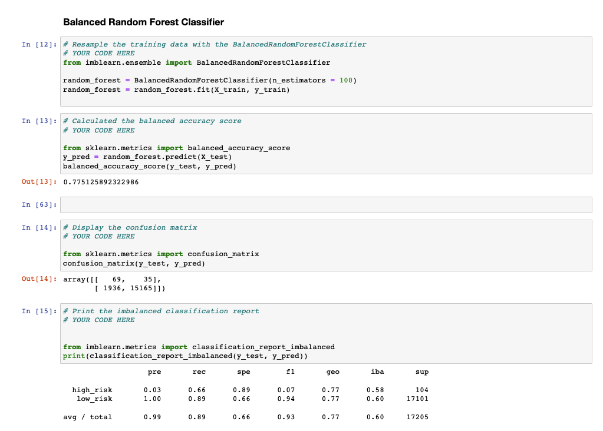

# Credit_Risk_Analysis

## Overview

Applied machine learning to predict credit risk for a financial instition. Since the data provided was unbalanced containing more good loans, different machines learning models needed to used for better accuracy rating. Accordingly, I used six different supervised machine learning models and evaulated their performance below. 

## Results

- Naive Random Oversampling model has a 63% balanced accuracy score. Recall for high risk is at 68% while precision for high risk is at 1%. 

- SMOTE Oversampling has a 66% balanced accuracy score. Its precision score for high risk is at 1% and recall for high risk at 63%. 

- At 40% the recall for low risk prediction is lower than our two previous models. Precision for high risk stands at 1%. Balanced accuracy score for undersampling is 66%. With a low recall rate for low risk prediction. this model wouldn't be ideal for credit risk prediction. 

- Balanced accuracy score for combination is at 54%, lower than our previous models. Precision score for high risk is at 1%. Recall is at 57%. 

​	

- Balanced Random Forest model has an balanced accuracy score of 77%. Precision score for high risk is at 3%, and the overall recall score is at an 89%. 

   

- This model has a 91% balanced accuracy score. Its precision score is also the highest at 9% and the overall recall score is at a 94% percent. 

  

## Summary 

The oversampling and undersampling plus the combination models were somewhat similar to one another on the accuracy score, precision, and recall. The two ensemble models performed much better than the oversampling, undersampling, and combination sampling models. My recommendation is to use the Easy Ensemble AdaBoost Classifier for credit risk predictions going forward. The Easy Ensemble Adaboost Classifier model had the highest scores for all elements out of all the models that we used. 

